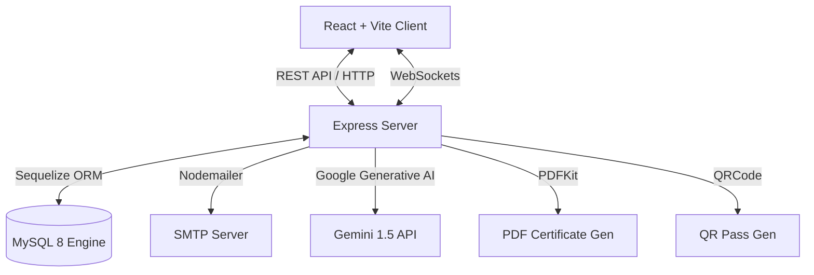
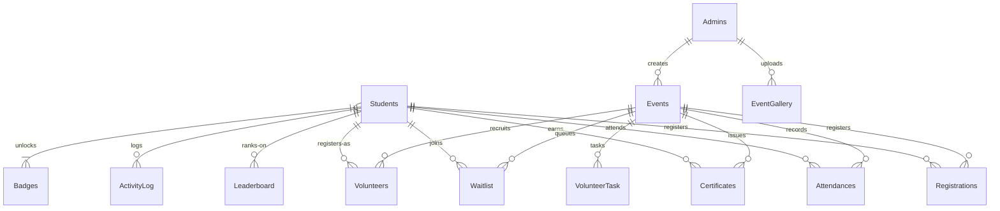
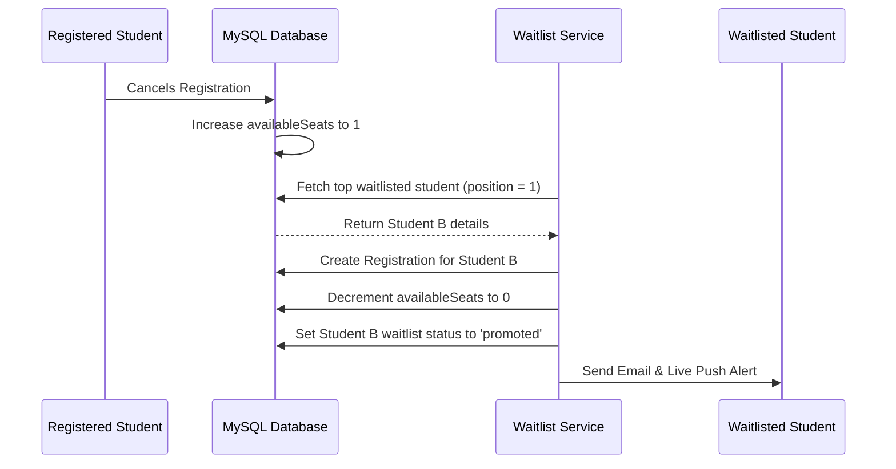

# College Event Registration Management System — Knowledge Transfer (KT) Kit

Welcome to the **College Event Registration Management System** Knowledge Transfer Kit. This document is a comprehensive onboarding and reference manual designed for developers, system administrators, and technical stakeholders to quickly understand, set up, and maintain this enterprise-ready campus application.

---

## 1. System Overview & Key Modules

The College Event Registration Management System is an enterprise-grade platform that facilitates event creation, registration, ticketing, gamification, and AI-driven assistance for campus activities. It is architected around two primary portals: the **Student Portal** (where students register for events, earn badges, volunteer, and get AI recommendations) and the **Admin/Executive Portal** (where event coordinators and supervisors create templates, manage seating, verify entry passes, perform analytics, and run backup recovery).

### Core Functional Modules
1. **Authentication & Identity Management**: Secure sign-in for Students and Admins, complete with account lockouts, password history restrictions, verify email flow, and login notification alerts for unrecognized devices.
2. **Event Scheduling & Templates**: Standard CRUD operations for scheduling events, setting registration deadlines, managing capacities, and creating reusable event templates.
3. **Double-Booking & Transaction Control**: Safe SQL transaction limits to prevent double-booking or overbooking beyond available capacities.
4. **Waitlist & Seating Promotion**: Dynamic event queues that auto-promote students when registered attendees cancel their tickets.
5. **Real-time Live Notifications**: Instant browser pushes via WebSockets (`Socket.IO`) coupled with emails (`Nodemailer`) for verification, event registration tickets, and reminders.
6. **QR Code Verification**: Generating secure entrance passes containing a scan-to-check-in verification workflow.
7. **Gamification, Badges & Leaderboard**: Student engagement driven by points, department rankings, refer-a-friend bonuses, and level progressions.
8. **Volunteer Coordination**: Student applications to volunteer, admin task allocation, and tracking of certified volunteer hours.
9. **AI Copilot & Assistant**: Underpinned by Gemini, offering chat capabilities, smart semantic search, auto-drafted event descriptions, attendee feedback analysis, and predictive turnout insights.
10. **Enterprise Administration**: Bulk CSV data import/export, role-based fine-grained permissions, configurable system settings, and automated daily backups.

---

## 2. Architecture & Tech Stack

The application employs a decoupled client-server architecture:



### Frontend (`/client`)
*   **Vite**: Build tool and dev server.
*   **React 19**: View rendering engine.
*   **React Router DOM**: SPA client-side routing.
*   **Tailwind CSS**: Styling utility framework.
*   **Lucide React**: Vector icons library.
*   **Recharts**: Chart visualizer for student check-ins, registration trends, and department analytics.
*   **html5-qrcode**: Integrated library for scanning registration tickets via webcam.
*   **Socket.io-client**: Real-time push listener.

### Backend (`/server`)
*   **Node.js & Express**: API gateway.
*   **Sequelize ORM**: Schema migration, relational mapping, and parameterized MySQL query execution.
*   **Socket.IO**: Real-time server broadcaster.
*   **Nodemailer**: Email composition and delivery.
*   **PDFKit**: On-the-fly PDF creation for credentials and certificates.
*   **qrcode**: Encodes tickets and certificates into scan-ready matrix codes.
*   **Helmet & Rate Limiter**: Core HTTP header hardening and API request throttling.
*   **@google/generative-ai**: Interface to the Gemini LLM for generating textual summaries and chat replies.

---

## 3. Database Schema & Entities

The system uses a relational MySQL database mapped through Sequelize. Below are the key tables and relationships:



### Table Directory & Description

| Database Table | Model File | Description | Keys & Indexes |
| :--- | :--- | :--- | :--- |
| `Students` | `Student.js` | Holds credentials, department, referral codes, and security policies (lockouts, OTP, password history). | PK: `id`, Unique: `rollNumber`, `email`, `referralCode` |
| `Admins` | `Admin.js` | Admin credentials, role name (e.g., Super Admin, Coordinator), and permission arrays. | PK: `id`, Unique: `username`, `email` |
| `Events` | `Event.js` | Stores scheduled events, venue details, dates, seat capacities, registration types (FREE/PAID), and template flags. | PK: `id`, FK: `createdBy` (Admins), Unique Index: `(title, venue, eventDate)` |
| `Registrations` | `Registration.js` | Links students to events. Stores ticket confirmation status and QR pass codes. | PK: `id`, FK: `studentId`, `eventId`, Unique Index: `(studentId, eventId, status)` |
| `Attendances` | `Attendance.js` | Records checked-in status (Present/Absent). | PK: `id`, FK: `registrationId`, `eventId`, `studentId` |
| `Certificates` | `Certificate.js` | Stores participation credentials, verification keys, and download links. | PK: `id`, FK: `registrationId`, `studentId`, `eventId`, Unique: `certificateId` |
| `Notifications` | `Notification.js` | Holds system alerts and unread status. | PK: `id`, FK: `userId` |
| `AuditLogs` | `AuditLog.js` | High-fidelity security logs tracking user activity, source IP, OS, and browser. | PK: `id`, FK: `userId` |
| `Waitlist` | `Waitlist.js` | Manages students queueing for full events. | PK: `id`, FK: `eventId`, `studentId` |
| `Volunteers` | `Volunteer.js` | Tracks students approved to work events and their total logged volunteering hours. | PK: `id`, FK: `studentId`, `eventId` |
| `VolunteerTasks` | `VolunteerTask.js` | Tracks work subtasks assigned to volunteers (e.g., Ticketing, Setup). | PK: `id`, FK: `volunteerId`, `eventId` |
| `Leaderboard` | `Leaderboard.js` | Summarizes students' points, events attended, and volunteer hours. | PK: `id`, FK: `studentId` |
| `Badges` | `Badge.js` | Defines milestone badges (e.g., First Check-in, Dedicated Volunteer). | PK: `id` |
| `StudentBadges` | `StudentBadge.js` | Junction table for student-badge many-to-many relationship. | FK: `studentId`, `badgeId` |
| `LoginHistories` | `LoginHistory.js` | Logs historical logins to detect unauthorized access patterns. | PK: `id`, FK: `userId` |
| `SystemSettings` | `SystemSetting.js` | Key-value store for app-wide branding, templates, and SMTP configs. | PK: `id`, Unique: `key` |

---

## 4. Key Functional Workflows

### A. Authentication & Security Policies
1.  **JWT Double Tokens**: Login endpoints return a short-lived access JWT and a 7-day refresh token stored in the database.
2.  **Failed Login Lockout**: If a student or admin inputs an incorrect password 5 consecutive times, the system sets `lockoutUntil` to 15 minutes in the future, blocking further attempts.
3.  **Password History Rule**: Hashed password histories are stored as an array. Users cannot recycle their last 3 passwords during resets.
4.  **Unknown Device Alert**: Logins query `LoginHistories` for matching `browser` and `os` signatures. If not found, a security warning is emailed.

### B. Event Registration & Atomic Transactions
When a student registers, the system executes an atomic database transaction:
1.  Verify the student is verified and active.
2.  Check for double-booking (whether they are registered for another event during the same time window).
3.  Verify seat availability (`availableSeats > 0`).
4.  Decrement `availableSeats` in the `Events` table, and write a row in the `Registrations` table.
5.  If capacity is 0, the transaction rolls back or routes them to join the `Waitlist` instead.

### C. Waitlist Promotion


### D. Gamification & Leaderboard Points
Students accumulate points dynamically based on interactions:
*   **Registration**: +10 Points.
*   **Marked Attendance (Present)**: +50 Points.
*   **Volunteer Hour**: +30 Points.
*   **Submitting Event Feedback**: +15 Points.
*   **Successful Friend Referral**: +25 Points (both referrer and referee receive points once referee verifies their account).
*   **Leveling System**: Points calculate levels via [GamificationService.js](file:///c:/Registration%20Portal/server/services/GamificationService.js):
    *   *Level 1*: 0 - 99 Points
    *   *Level 2 (Explorer)*: 100 - 249 Points
    *   *Level 3 (Achiever)*: 250 - 499 Points
    *   *Level 4 (Elite)*: 500+ Points

### E. AI Copilot Architecture
The AI engine resides in [aiController.js](file:///c:/Registration%20Portal/server/controllers/aiController.js). It handles tasks via Google's Gemini models, falling back to a structured rule-based parser in [intentClassifier.js](file:///c:/Registration%20Portal/server/utils/intentClassifier.js) if API keys are missing:

*   **Rule-based Classifier**: Matches keywords inside queries (e.g., "how do I get my cert?") to known intent buckets (`FEEDBACK`, `CERTIFICATES`, `WAITLIST`, etc.) and pulls preset context responses.
*   **Context Injection**: For active chats, the server programmatically scans the message for keywords (like "my registrations", "badges", "attendance") and injects live database statistics directly into the prompt system instructions before calling Gemini.

### F. Automated Backups & Schedulers
The system runs background timers in `server.js` on startup:
*   **Reminders Service**: Runs every 15 minutes. Scans upcoming events starting within the next 24 hours or 1 hour, triggers bulk reminder emails containing venue details and ticketing info, and updates flag markers (`reminderSent24h`, `reminderSent1h`).
*   **Database Backup Manager**: Runs on startup and loops every 24 hours in production. Creates SQL dump files in the `server/backups` folder.

---

## 5. Directory Mapping

Here is where core files reside:

```text
Registration Portal/
├── database/
│   └── schema.sql                <-- MySQL Schema Creation Script
├── server/
│   ├── config/
│   │   ├── database.js           <-- Sequelize Instance Setup
│   │   └── mailConfig.js         <-- Default SMTP Transporter
│   ├── controllers/
│   │   ├── adminController.js    <-- Lockouts & Device Alert Rules
│   │   ├── aiController.js       <-- Chat, Insights, Sentiment & Predictions
│   │   └── registrationController.js <-- Transaction Control & Registrations
│   ├── middleware/
│   │   ├── authMiddleware.js     <-- JWT validation rules
│   │   ├── auditLogger.js        <-- Audit Logging Interceptor
│   │   └── security.js           <-- Helmet & Rate Limiter config
│   ├── models/
│   │   └── index.js              <-- Entity relationships & bindings
│   ├── routes/
│   │   └── aiRoutes.js           <-- AI Endpoint definitions
│   ├── services/
│   │   ├── AIService.js          <-- Gemini client interface & Fallbacks
│   │   └── reminderService.js    <-- 24h & 1h Background cron
│   └── utils/
│       ├── intentClassifier.js   <-- Keyword rule definitions
│       └── sendEmail.js          <-- Email templating engine
└── client/
    ├── src/
    │   ├── App.jsx               <-- React Route mappings
    │   ├── pages/
    │   │   ├── AIAssistant.jsx   <-- Chat Widget
    │   │   └── AdminQRScanner.jsx <-- QR Camera verification page
    │   └── services/             
    │       └── api.js            <-- Axios client configurations
```

---

## 6. Local Setup & Testing

### Prerequisites
*   **Node.js**: v18+ recommended.
*   **MySQL**: v8.0+.

### Step 1: Database Initialization
1.  Open your MySQL command line client and execute:
    ```sql
    CREATE DATABASE college_event_registration;
    ```
2.  Import schema details:
    ```bash
    mysql -u root -p college_event_registration < database/schema.sql
    ```

### Step 2: Configure Environment Settings
Create a `.env` file in the `server/` directory:
```env
PORT=5000
NODE_ENV=development

# Database Settings
DB_HOST=127.0.0.1
DB_PORT=3306
DB_NAME=college_event_registration
DB_USER=root
DB_PASSWORD=your_mysql_root_password

# JWT Access keys
JWT_SECRET=developer_access_secret_key
JWT_REFRESH_SECRET=developer_refresh_secret_key
JWT_EXPIRES_IN=1d

# SMTP Configuration (Optional: Use Mailtrap for debugging)
SMTP_HOST=smtp.mailtrap.io
SMTP_PORT=2525
SMTP_USER=your_mailtrap_user
SMTP_PASS=your_mailtrap_password
EMAIL_FROM_NAME=College Events System
EMAIL_FROM_ADDRESS=noreply@college.edu

# AI Capabilities (Optional: Fallbacks will run if empty)
GEMINI_API_KEY=your_gemini_api_key_here
```

### Step 3: Run the Servers
1.  **Start Backend**:
    ```bash
    cd server
    npm install
    npm run dev
    ```
    *Note: On startup, the server automatically syncs new Sequelize fields, seeds default system configurations, and populates initial milestone badges.*

2.  **Start Frontend**:
    ```bash
    cd ../client
    npm install
    npm run dev
    ```
    Open [http://localhost:5173](http://localhost:5173) in your browser.

### Step 4: Run Automated Tests
The backend features an integration test suite powered by Jest. Run it using:
```bash
cd server
npm test
```
This executes tests checking auth behaviors, registration bounds, intent classifiers, gamification milestones, and QR ticketing mechanisms.

---

## 7. Operational Troubleshooting

> [!IMPORTANT]
> **API Port Conflicts**: The backend uses Port `5000` by default. If the port is in use, verify if a duplicate server instance is running in the background. The server handles this gracefully by warning you and remaining available if already listening.

> [!WARNING]
> **Gemini Rate Throttling**: The AI service includes a `delay(200)` wrapper to throttle consecutive calls and avoid API exhaustion. If the Gemini API returns status `429` (Quota Exceeded), the service automatically retries twice with exponential backoff before falling back to local mock payloads.

> [!TIP]
> **Simulating Emails in Testing**: In `test` environments, Nodemailer emails are bypassed. The console outputs `[Email Simulation] To: ... | Subject: ...` instead, preventing outbound calls.
